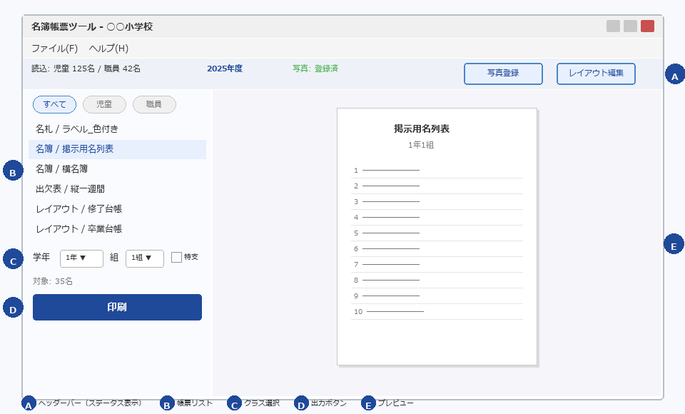
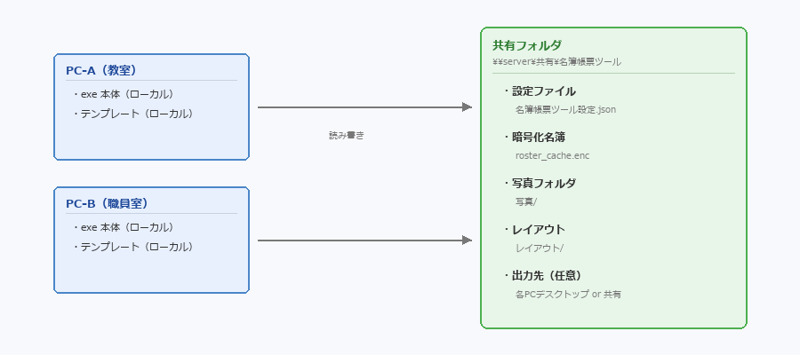
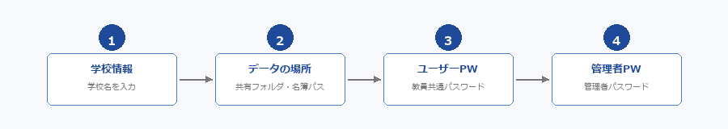
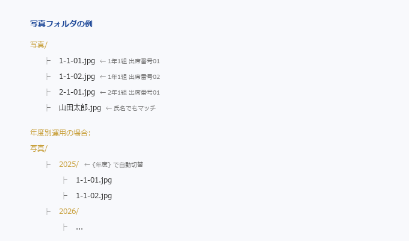

# 名簿帳票ツール

小中学校向けの **名簿帳票自動生成 Windows デスクトップアプリ** です。

校務支援システムの Excel / CSV エクスポートを読み込み、名札・ラベル・名簿・台帳などの帳票を自動生成・直接印刷します。



---

## ダウンロード

最新版は [Releases ページ](https://github.com/atariryuma/meiboTool-releases/releases/latest) からダウンロードできます。

| ファイル | 用途 |
|----------|------|
| **MeiboToolSetup-vX.X.X.exe** | **インストーラー版（推奨）** — 各PCにインストールし、データのみ共有フォルダで運用 |
| **meibo-tool-vX.X.X.zip** | ZIP版（インストール不要） — 共有フォルダに展開して直接起動 |

---

## 主な機能

| 機能 | 説明 |
|------|------|
| **Excel テンプレート帳票** | ラベル（色付き・大・小・特大）・横名簿・縦一週間・男女一覧・掲示用名列表 |
| **レイアウト帳票** | 既存のレイアウトファイルを取り込んで直接印刷（台帳・調べ表・名列表 等） |
| **レイアウトエディター** | 画面上でレイアウトの編集・プレビュー・印刷が可能 |
| **写真差込** | 児童写真をフォルダから自動マッチングし帳票に差し込み |
| **名簿・写真の暗号化** | AES 暗号化キャッシュで共有フォルダの個人情報を保護 |
| **特別支援学級** | 交流学級への自動統合・末尾追加の切り替え対応 |
| **年度管理** | 自動/固定年度切替・次年度作成・年度ロック・年度連動パス |
| **職員名簿** | 職員向けレイアウト帳票にも対応 |
| **アプリ内自動更新** | 新バージョンの通知・ダウンロードをアプリ内で完結 |
| **共有データ運用** | 設定・写真・暗号化名簿キャッシュを複数PCで共有 |

---

## 導入方法（推奨：インストーラー版 + 共有データ）

各PCにインストールして実行ファイルをローカル配置し、名簿・写真・設定は共有フォルダにまとめる構成が安定します。



### 手順

1. [Releases ページ](https://github.com/atariryuma/meiboTool-releases/releases/latest) から **MeiboToolSetup-vX.X.X.exe** をダウンロード
2. 各PCにインストールして起動
3. 初期設定ウィザードの「データの場所」で **共有フォルダ** を指定
4. 児童名簿・職員名簿・写真フォルダを設定
5. 以降はデスクトップのショートカットから起動

### この構成のメリット

- **起動時のネットワーク影響が小さく、フリーズしにくい**
- 実行ファイルの更新失敗リスクが低い
- データ（名簿・写真・設定）は共有運用を維持できる

---

## 導入方法（ZIP版）

インストールが難しい環境では ZIP 版も利用できます。

1. **meibo-tool-vX.X.X.zip** をダウンロード
2. 校内LANの共有フォルダに展開する

```
\サーバー名\共有フォルダ\
└── 名簿帳票ツール\          ← ZIP を展開した中身
    ├── 名簿帳票ツール.exe   ← これを各PCから起動
    ├── ★デスクトップにショートカットを作成.vbs
    ├── _internal\
    ├── テンプレート\
    └── レイアウト\
```

3. 各PCで「**★デスクトップにショートカットを作成.vbs**」をダブルクリック
4. 以降はデスクトップのショートカットから起動

---

## 初回セットアップ

初めて起動すると **セットアップウィザード** が表示されます。画面の案内に沿って 4 ステップで設定してください。



| ステップ | 内容 |
|---------|------|
| 1. 学校情報 | 学校名を入力（帳票タイトルに使われます） |
| 2. データの場所 | 共有フォルダ（任意）と児童名簿を指定。職員名簿・写真は後から設定可能 |
| 3. ユーザーPW | 全教員が起動時に入力するパスワード（名簿データの暗号化に使用） |
| 4. 管理者PW | 設定変更時に必要な管理者パスワード |

> セットアップ後も「ファイル → 管理者設定」からいつでも変更できます。

---

## 基本の流れ

どの帳票でも、操作は **帳票を選ぶ → 設定する → 出力する** の 3 ステップです。

1. **帳票を選ぶ** — 画面左側の帳票リストから帳票を選ぶと、右側にプレビューが表示される
2. **対象を設定する** — 帳票リストの下に表示される **学年・組** のドロップダウンで対象クラスを選ぶ
3. **出力する** — 帳票リスト下部の **「印刷」** または **「Excel書き出し」** ボタンで出力

> 帳票リスト上部のフィルターで **「すべて」「児童」「職員」** を切り替えると表示を絞り込めます。

---

## 写真の登録

写真フォルダに以下のいずれかの名前で画像ファイル（JPG / PNG）を置くと自動マッチングされます。

| ファイル名の例 | 説明 |
|-------------|------|
| `1-1-01.jpg` | 学年-組-出席番号（ゼロ埋め 2 桁） |
| `1-1-1.jpg` | 学年-組-出席番号（ゼロ埋めなし） |
| `01.jpg` | 出席番号のみ（クラスが 1 つの場合） |
| `山田太郎.jpg` | 氏名（スペースなし） |



- **一括:** ルールに従ってファイルを写真フォルダに入れるだけで自動認識
- **個別:** ヘッダーバーの **「写真登録」** ボタンから 1 人ずつ登録

> サブフォルダ（`写真/1年/01.jpg` など）にも対応しています。拡張子の大小文字は区別しません。

---

## アプリの更新

新しいバージョンがリリースされると、起動時に自動で通知されます。

- **インストーラー版の場合**: 通知からそのまま更新できます
- **ZIP版の場合**: 新バージョンの ZIP をダウンロードして共有フォルダに上書き展開してください

---

## セキュリティについて

校務支援システムからエクスポートした Excel / CSV には、児童の氏名・生年月日・住所・保護者情報などの個人情報が含まれています。本アプリでは名簿データを **暗号化した状態でのみ保存** し、元の Excel / CSV は取り込み後に削除できる仕組みにしています。

| 項目 | 内容 |
|------|------|
| **暗号化** | AES-128-CBC + HMAC-SHA256（Fernet）で名簿・写真を暗号化保存 |
| **鍵導出** | ユーザーパスワードから PBKDF2-SHA256（600,000回反復）で導出 |
| **2層パスワード** | ユーザーPW（全教員共通）と管理者PW（設定変更用）の 2 層構成 |
| **試行回数制限** | パスワード 5 回失敗で 30 秒間ロックアウト |
| **排他制御** | 共有フォルダ上での同時アクセス時のファイルロック機構 |
| **アトミック書込** | 書込中クラッシュでもデータ破損なし |

---

## 品質について

| 項目 | 内容 |
|------|------|
| 自動テスト | **1,900 件以上**のテストケースを全リリースで実行 |
| コードカバレッジ | 45% 以上を CI で保証 |
| 静的解析 | ruff リンターによるコード品質チェック |
| CI/CD | GitHub Actions でリント → テスト → ビルド → リリースを自動化 |

---

## 動作要件

- Windows 10 / 11
- 画面解像度 1024×768 以上推奨
- 配布版（exe）は Python のインストール不要

---

## お問い合わせ

不具合や要望は [Issues](https://github.com/atariryuma/meiboTool-releases/issues) からご報告ください。
